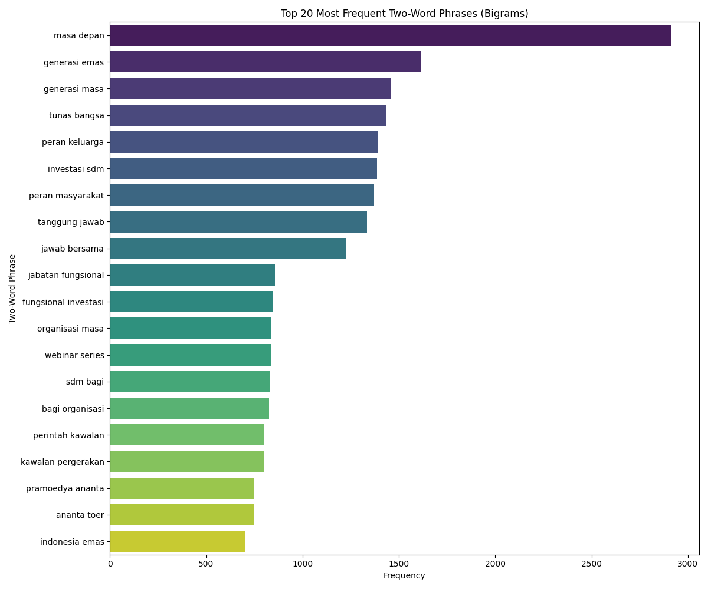
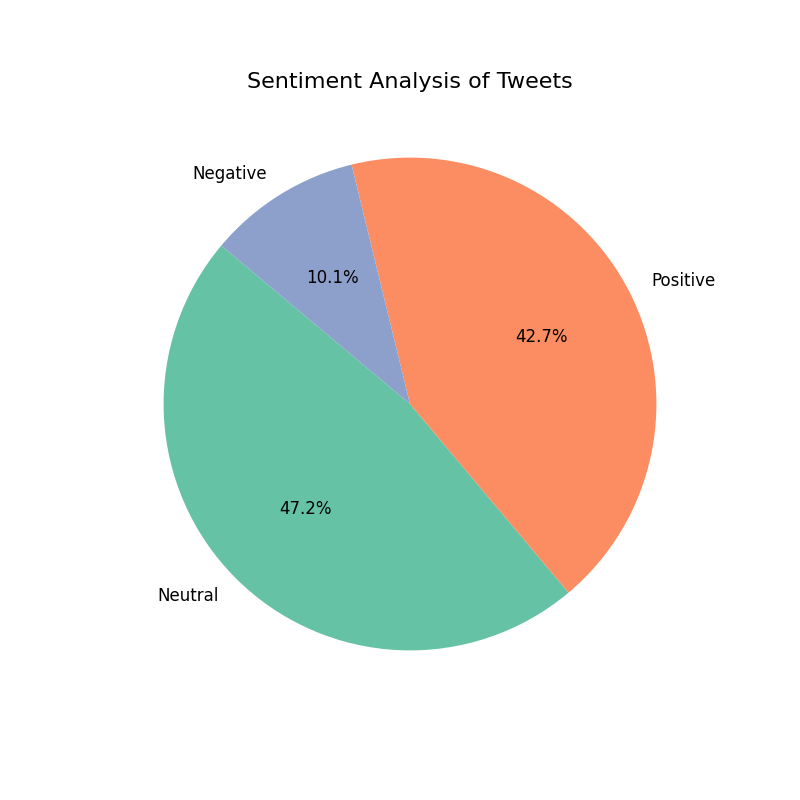

# Proyek Analisis Tweet Masyarakat

Repositori ini berisi skrip dan data yang berkaitan dengan proyek penambangan dan analisis data tweet masyarakat terkait isu "Generasi Emas 2045".

## Alur Kerja Proyek

1.  **Crawling Data:** `crawling.py` digunakan untuk mengumpulkan data tweet dari Twitter berdasarkan kata kunci yang relevan.
2.  **Processing Data:** `processing.py` menggabungkan data mentah dari `generasi_emas_2045.csv` dan `generasi_emas1_2045.csv`, membersihkan dan memilih kolom yang relevan, dan menyimpannya ke `cleaned_data.csv`.
3.  **Visualisasi Data:** `visualisasi.py` melakukan analisis lebih lanjut pada `cleaned_data.csv`, termasuk analisis frekuensi bigram dan analisis sentimen, lalu menghasilkan visualisasi yang disimpan sebagai file gambar.

## Ikhtisar Berkas

-   `crawling.py`: Skrip untuk mengumpulkan data tweet.
-   `generasi_emas_2045.csv`, `generasi_emas1_2045.csv`: Berkas CSV berisi data mentah.
-   `processing.py`: Skrip untuk membersihkan dan memproses data mentah.
-   `cleaned_data.csv`: Berkas CSV berisi data yang sudah bersih dan siap dianalisis.
-   `visualisasi.py`: Skrip untuk menganalisis dan memvisualisasikan data yang sudah bersih.
-   `word_frequency.png`: Plot batang frekuensi kata yang paling umum.
-   `bigram_frequency.png`: Plot batang frasa dua kata (bigram) yang paling umum.
-   `sentiment_analysis.png`: Diagram lingkaran yang menunjukkan distribusi sentimen tweet.

## Hasil Analisis

### Analisis Statistik Deskriptif

- **Total Tweet:** 15,939
- **Tweet Unik:** 7,608
- **URL Unik:** 8,042

### Frekuensi Bigram

Plot berikut menunjukkan 20 frasa dua kata yang paling sering muncul dalam dataset, memberikan gambaran tentang topik utama yang dibicarakan.

### Analisis Sentimen

Analisis sentimen menunjukkan distribusi sentimen dari tweet-tweet yang dikumpulkan.

